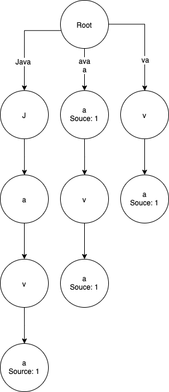
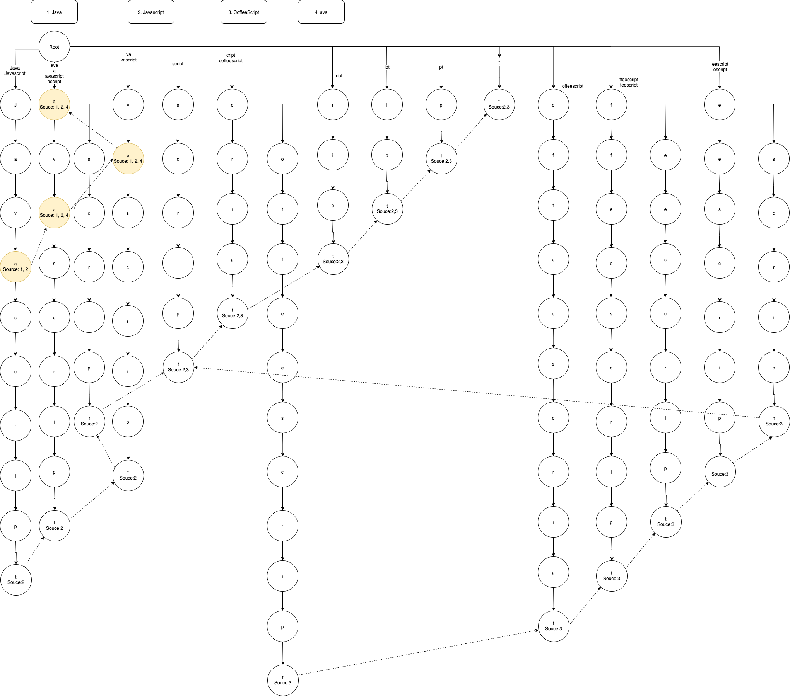
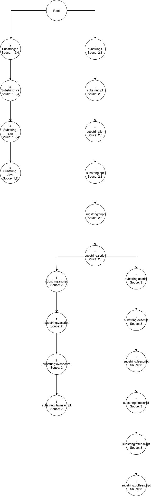
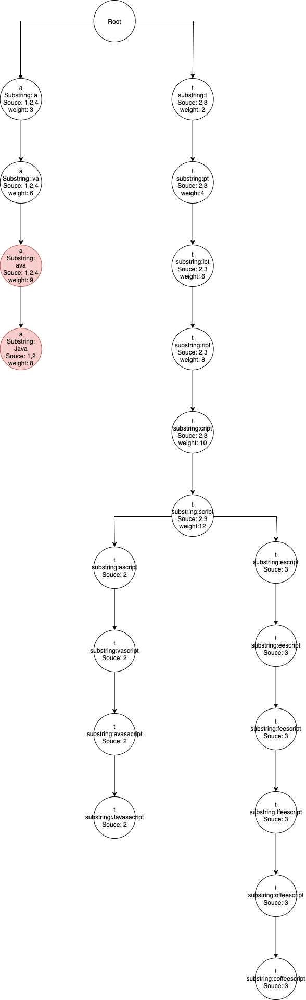

# Find all common substrings

So method is aim to find all the common substrings in a large sample.
So the key point is how to find the all the repeated substring and their occurence, and then we will try to find a method to list them.
Here I will start with an example with following 4 words: 

```javascript
let list = ["java", "javascript", "coffeescript", "python"]
```

A suffix trie is the start point for listing all the fragment
For example, we build the trie start with a string, and put the letters one by one in the trie, at the end leaf of the string, we record its source index number in the `list`:


then for all the suffix of the string, i.e. `ava`, `va`, `a`, we also add them into the trie, and they have the same source index `1`. the end of the leaf are also linked one by one.

At the end the trie would be:



Then we do the same for all the other strings in the `list`, the built trie is as followings, all the dashed line linked with end of leaves has composite another trie, we call it `verticalTrie`.


Since now only the longest substring has the source index number, we also need to add the source indexes to the short substrings for next calculation. For example in the first branch in the trie, `t` from `javascript` has source index `2`, but `java` also are included in `javascript`, so we will need to add `2` to the node `a` which is colored with yellow background. We do the same for each branch and then we got the following updated trie. 



Now we got all the nodes we interested with source indexes. They are all include





